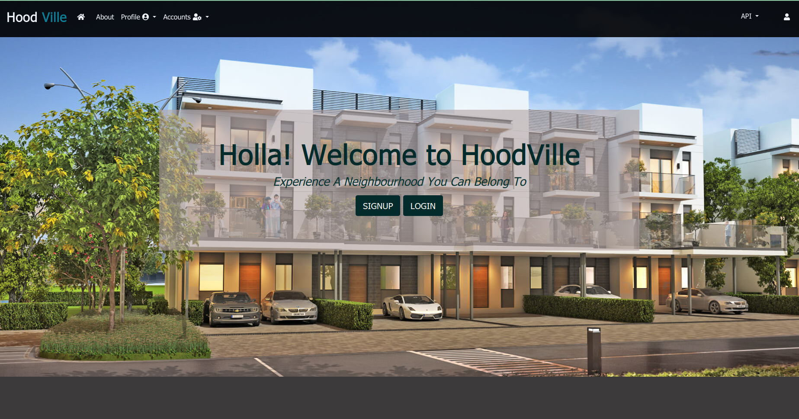

# HOODVILLE- 
We recognize that thriving communities are made up of the neighbors and organizations that build stronger, more vibrant, and resilient neighborhoods.

### Screenshots

 
 

## Setup/Installation Requirements

1.Cloning the repository: https://github.com/oyesa/Neighbourhood-App.git

**Clone to _development_ branch --'''git checkout development'''**

2.Navigate into the folder and install requirements
bash cd neighborhood

3.Install and activate Virtual
-python3 -m venv virtual - source virtual/bin/activate

4.pip install -r requirements.txt

5.Setup Database
-SetUp your database User,Password, Host then make migrate
-python manage.py makemigrations 
-python manage.py migrate

6.python manage.py runserver

###### Testing the application
- python manage.py test

## Technologies Used
*Python3*,
*Django-Framework*,
*REST-API*,
*Heroku*,
*Postgres*,
*Cloudinary*,
